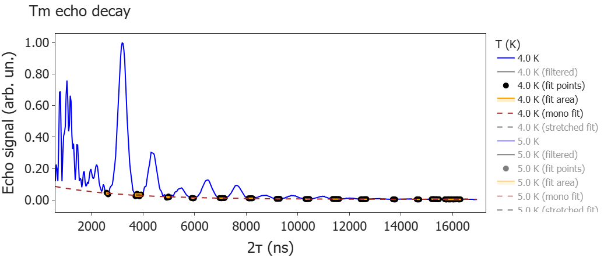

# Exponential Extraction from Oscillatory Echo Signals

This repository contains a Jupyter notebook workflow for extracting an exponentially decaying signal from time traces that are strongly modulated by oscillations with varying amplitude, such as from a Hahn-echo experiment in EPR spectroscopy. This is especially useful when the exponential decay is not obvious because of a strongly oscillatory signal. The notebook filters the oscillatory component, identifies usable fitting windows, and fits the remaining decay to monoexponential, Gaussian, and stretched-exponential models.

The workflow follows a typical data-analysis pipeline: load raw measurement files, preprocess and normalise the signal, select fitting windows, compare nonlinear models, and visualise the fitted parameters. The notebook acts as the user-facing analysis interface, while the reusable processing logic is located in a small Python module under `src/exponential_extraction/`.

## Example output



The output shows a dataset taken at 4 K. The dashed line represents a monoexpential decay function that was fitted to the local minima of the oscillation signal. The points are the anchoring points for the fit. Further fits can be selected, but are not shown in this figure.

## Repository structure

```text
Exponential_extraction/
  data/                     Input `.dat` files used in the analysis, e.g. from XEPR
  exponential_extraction/   Import shim for running from the repository root
  notebooks/
    exponential_extraction.ipynb
  src/
    exponential_extraction/
      analysis.py           Reusable analysis helpers used by the notebook
  example_result.png        Representative output figure
  README.md
  requirements.txt
  .gitignore
```

## What the notebook does

The notebook in [notebooks/exponential_extraction.ipynb](notebooks/exponential_extraction.ipynb):

- Provides grouped setup, analysis, and plotting settings directly in the notebook
- Loads temperature-dependent echo traces from the `data/` folder
- Runs the main processing pipeline through `run_Tm_analysis(...)`
- Normalises the real part of the signal
- Applies a Butterworth low-pass filter to suppress oscillatory structure
- Identifies peak-based fitting windows
- Fits the extracted decay with
  - A monoexponential model
  - A Gaussian model
  - A stretched-exponential model
- Compares fitted parameters as a function of temperature

## Data format

The current workflow expects tab-separated `.dat` files in the `data/` folder. File names are parsed for temperatures of the form `_*K`, for example `010_Tm_8K.dat`.

Each file is expected to contain:

- A first column with delay values in ns, typically exported from XEPR measurement files
- A second column with complex-valued echo data using `i` notation, for example `418568.71+90376.138i`
- Phased data, where the majority of the signal is in the real part

Example:

```text
600    418568.71+90376.138i
632    795365.41-15357.282i
664    692311.66-1341.3526i
```

## Running the notebook

1. Create and activate a Python environment.
2. Install the required packages:

```bash
pip install -r requirements.txt
```

3. Start Jupyter from the repository root:

```bash
jupyter notebook
```

4. Open `notebooks/exponential_extraction.ipynb` and run the cells in order.

The notebook is divided into setup/settings cells and analysis cells, so parameters can be reviewed before running the full workflow.

## Outputs

The notebook produces:

- Raw and filtered decay traces
- Selected fitting windows
- Monoexponential, stretched-exponential, and Gaussian-style fit results
- Temperature-dependent `Tm` comparison plots
